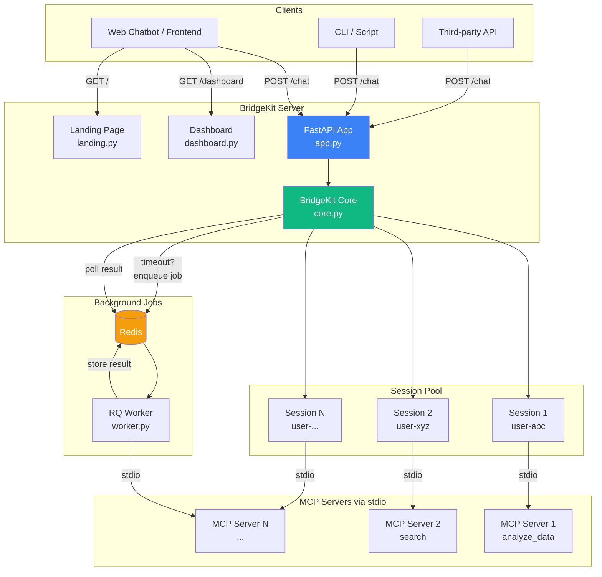
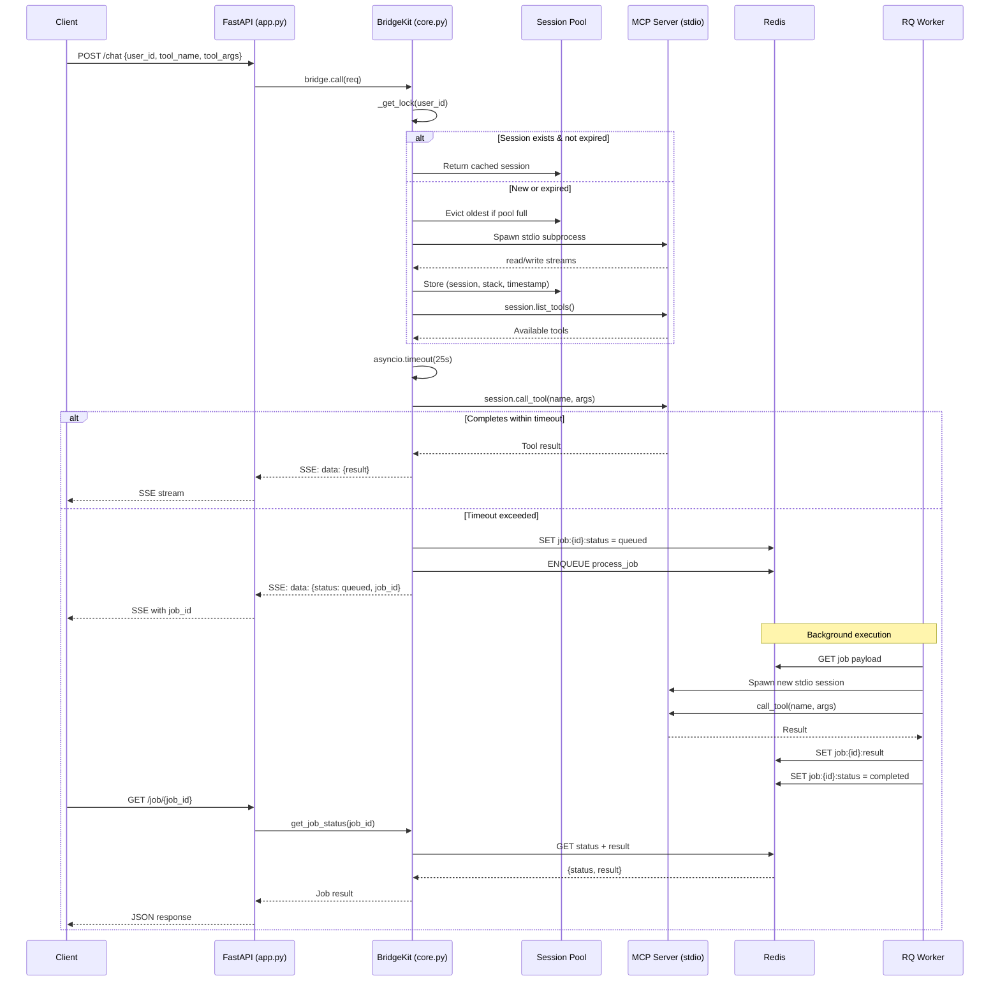
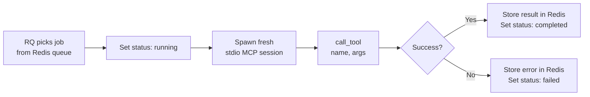
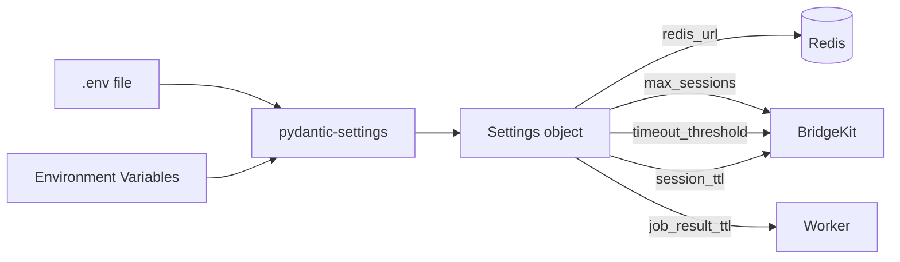
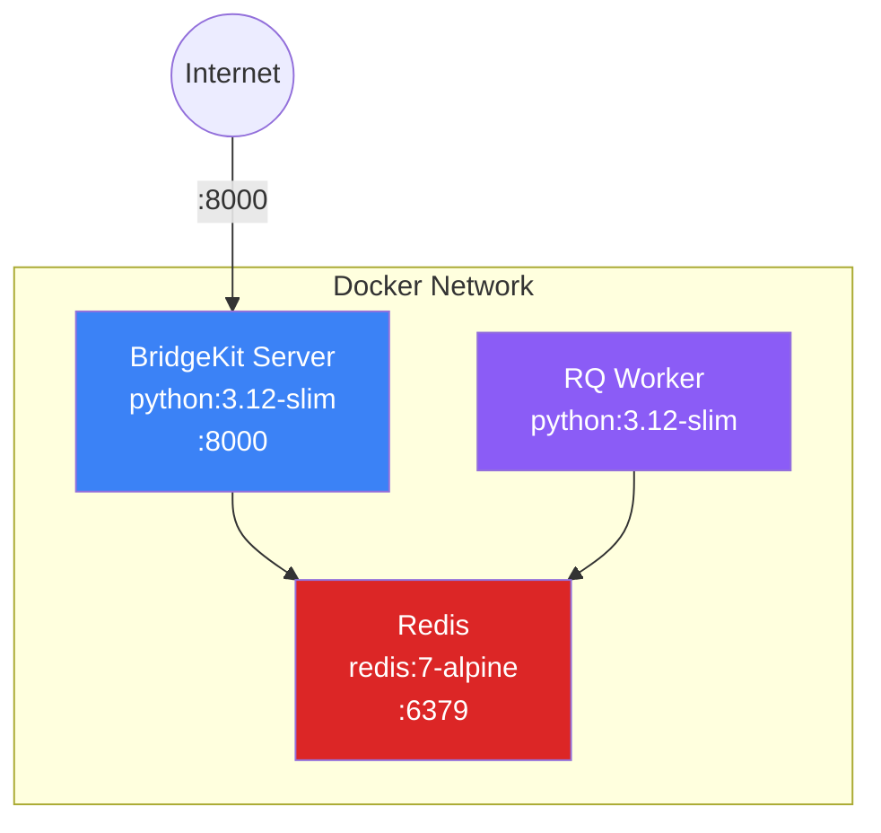
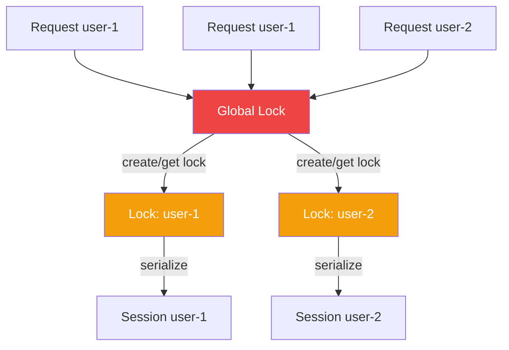

# Architecture

> MCP BridgeKit v0.6 — Embeddable MCP stdio → HTTP bridge

## High-Level Overview



## Request Flow



## Directory Structure

```
mcp-bridgekit/
├── src/mcp_bridgekit/          # Python package
│   ├── __init__.py             # Exports: BridgeKit, BridgeRequest, settings
│   ├── app.py                  # FastAPI app — routes, lifespan
│   ├── core.py                 # BridgeKit class — session pool, timeouts, jobs
│   ├── config.py               # pydantic-settings — env-based config
│   ├── models.py               # Pydantic request/response models
│   ├── worker.py               # RQ background worker — executes timed-out jobs
│   ├── dashboard.py            # /dashboard route — HTMX live view
│   ├── landing.py              # / route — landing page
│   └── stripe.py               # Stripe integration skeleton (commented)
├── ts/                         # TypeScript implementation
│   ├── src/index.ts            # Express server — same architecture
│   ├── package.json
│   └── tsconfig.json
├── templates/
│   └── dashboard.html          # HTMX + Tailwind dashboard template
├── examples/
│   ├── fastapi_app.py          # Embedding example
│   └── mcp_server.py           # Demo MCP server (FastMCP)
├── tests/
│   └── test_core.py            # Unit tests (mocked Redis)
├── Dockerfile
├── docker-compose.yml          # Redis + BridgeKit + Worker
├── pyproject.toml
├── .github/workflows/ci.yml    # CI: test + publish
└── .env.example
```

## Component Details

### `core.py` — BridgeKit Class

The heart of the system. Manages:

| Responsibility | Implementation |
|---|---|
| **Session pooling** | `Dict[user_id → (ClientSession, AsyncExitStack, timestamp)]` |
| **Per-user locking** | `_global_lock` protects lock-map creation; per-user `asyncio.Lock` serializes session access |
| **Pool limits** | Evicts oldest session when `max_sessions` exceeded |
| **Session TTL** | Checks `time.time() - created_at` against `session_ttl_seconds` |
| **Timeout handling** | `asyncio.timeout(threshold)` wraps `session.call_tool()` |
| **Background jobs** | On timeout: stores status in Redis, enqueues via RQ |
| **Tool discovery** | Calls `session.list_tools()` on new sessions, caches per user |
| **Logging** | Structured logging + in-memory `deque(maxlen=100)` for dashboard |

### `app.py` — API Surface

| Endpoint | Method | Purpose |
|---|---|---|
| `/chat` | POST | Call MCP tool → SSE stream (auto-queues on timeout) |
| `/job/{job_id}` | GET | Poll background job status/result |
| `/tools/{user_id}` | GET | List available MCP tools |
| `/session/{user_id}` | DELETE | Close a user's session |
| `/health` | GET | Health + active session count |
| `/dashboard` | GET | Live HTMX dashboard |
| `/dashboard/data` | GET | JSON data feed for dashboard |
| `/` | GET | Landing page |
| `/docs` | GET | Auto-generated OpenAPI docs |

### `worker.py` — Background Job Execution



Workers run in a separate process. Each job spins up its own MCP session (independent of the main server's pool) to avoid blocking the API.

### `config.py` — Settings

All settings use `MCP_BRIDGEKIT_` prefix and can be set via environment variables or `.env` file:



## Deployment Architecture

### Docker Compose (Recommended)



```bash
docker-compose up        # Starts all 3 services
```

### Manual / Bare Metal

```bash
# Terminal 1: Redis
redis-server

# Terminal 2: API server
uvicorn mcp_bridgekit.app:app --host 0.0.0.0 --port 8000

# Terminal 3: Background worker
mcp-bridgekit-worker
```

## Data Flow — Redis Keys

| Key Pattern | Type | TTL | Purpose |
|---|---|---|---|
| `bridgekit:job:{id}:status` | String (JSON) | `job_result_ttl_seconds` | Job state: `queued` / `running` / `completed` / `failed` |
| `bridgekit:job:{id}:result` | String (JSON) | `job_result_ttl_seconds` | Tool call result (set by worker on completion) |
| RQ internal keys | Various | Managed by RQ | Queue metadata, job payloads |

## Concurrency Model



- **Global lock** (`_global_lock`): Only held briefly to look up or create per-user locks. Prevents race conditions.
- **Per-user locks**: Serialize all session operations for a single user. Different users run concurrently.
- **asyncio.timeout**: Non-blocking timeout wrapper — the event loop stays responsive.

## TypeScript Version

The `ts/` directory contains a parallel Express implementation with the same architecture:

- Same session pooling (Map-based)
- Same timeout → Redis queueing pattern
- Same API surface (`POST /chat`, `GET /health`, `DELETE /session/:userId`)

```bash
cd ts && npm install && npm run build && npm start
```
