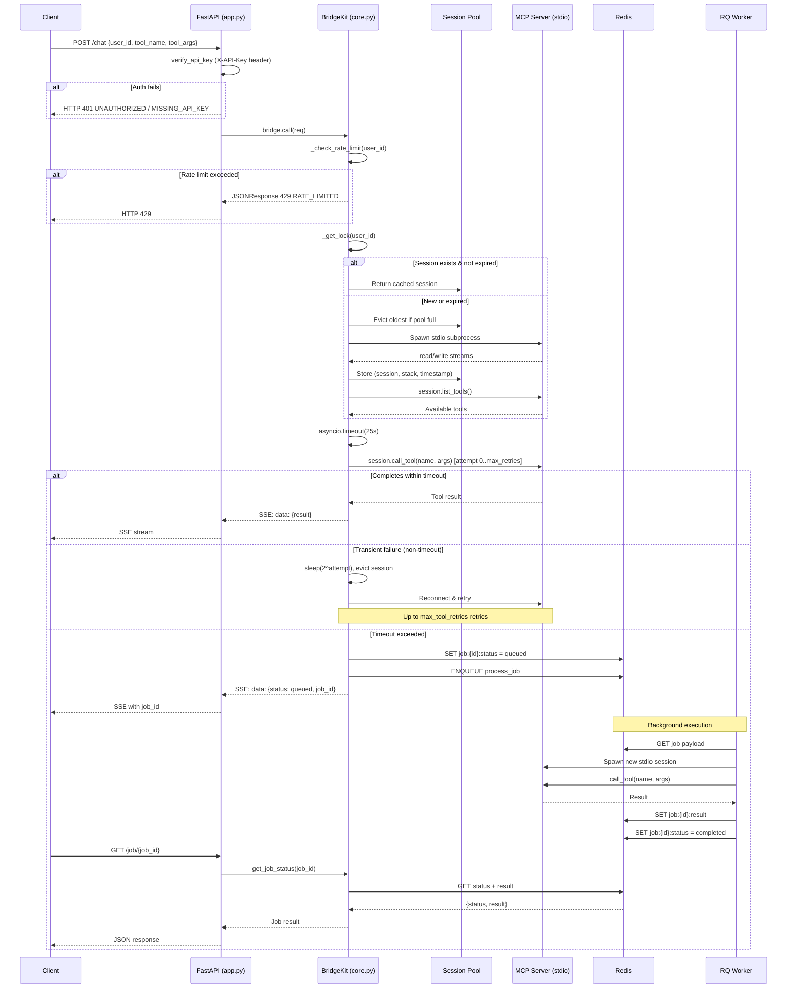
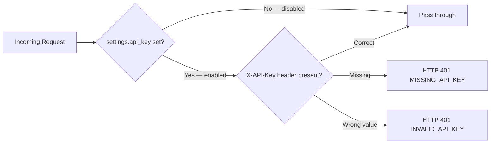
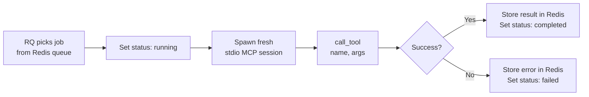
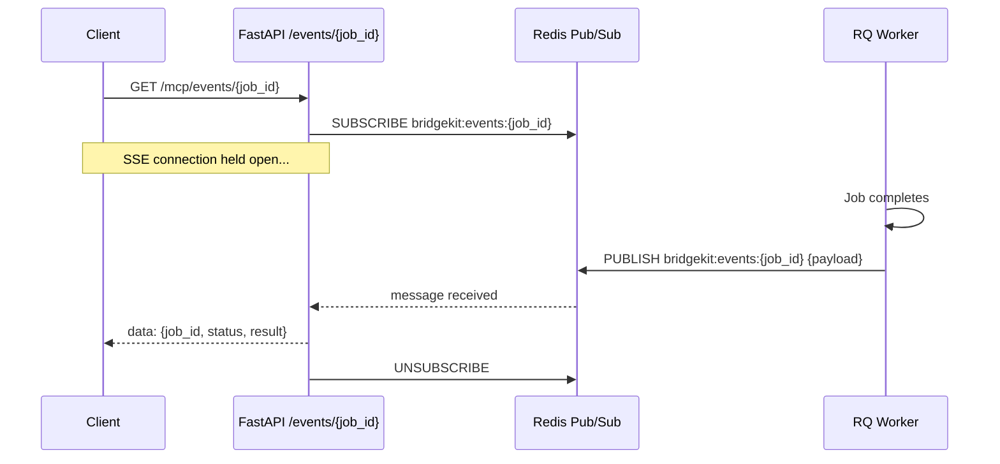
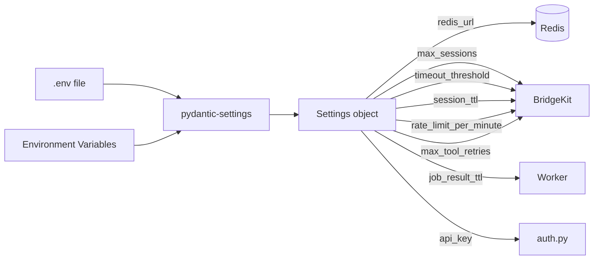
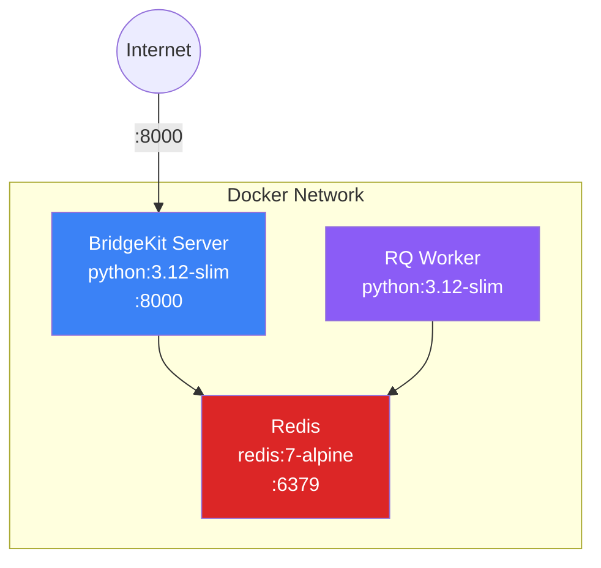
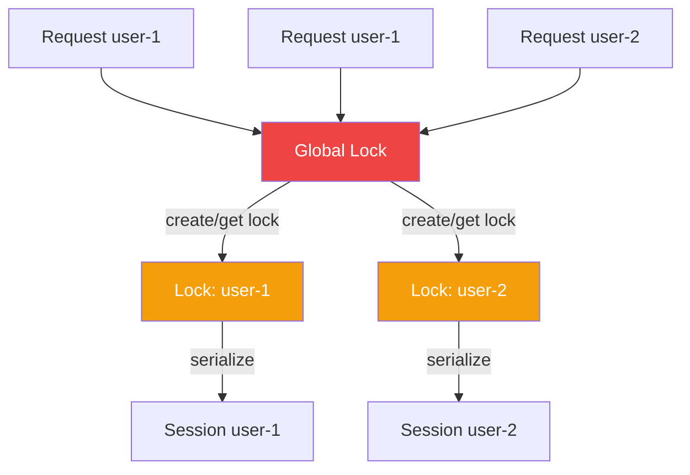

# Architecture

> MCP BridgeKit v0.8.0 — Embeddable MCP stdio → HTTP bridge

## High-Level Overview

```mermaid
graph TB
    subgraph Clients
        WEB[Web Chatbot / Frontend]
        CLI[CLI / Script]
        API[Third-party API]
    end

    subgraph BridgeKit Server
        FP[FastAPI App<br/>app.py]
        AUTH[Auth Middleware<br/>auth.py]
        CORE[BridgeKit Core<br/>core.py]
        DASH[Dashboard<br/>dashboard.py]
        LAND[Landing Page<br/>landing.py]
        METRICS[/metrics endpoint]
    end

    subgraph Session Pool
        S1[Session 1<br/>user-abc]
        S2[Session 2<br/>user-xyz]
        SN[Session N<br/>user-...]
    end

    subgraph MCP Servers via stdio
        MCP1[MCP Server 1<br/>analyze_data]
        MCP2[MCP Server 2<br/>search]
        MCPN[MCP Server N<br/>...]
    end

    subgraph Background Jobs
        RQ[RQ Worker<br/>worker.py]
        REDIS[(Redis)]
    end

    WEB -->|POST /chat| FP
    CLI -->|POST /chat| FP
    API -->|POST /chat| FP
    WEB -->|GET /dashboard| DASH
    WEB -->|GET /| LAND
    WEB -->|GET /metrics| METRICS

    FP --> AUTH
    AUTH -->|verified| CORE
    AUTH -->|401/429| FP
    CORE --> S1
    CORE --> S2
    CORE --> SN

    S1 -->|stdio| MCP1
    S2 -->|stdio| MCP2
    SN -->|stdio| MCPN

    CORE -->|timeout?<br/>enqueue job| REDIS
    REDIS --> RQ
    RQ -->|stdio| MCPN
    RQ -->|store result| REDIS
    CORE -->|poll result| REDIS

    style CORE fill:#10b981,color:#fff
    style REDIS fill:#f59e0b,color:#fff
    style FP fill:#3b82f6,color:#fff
    style AUTH fill:#ef4444,color:#fff
```

## Request Flow



## Directory Structure

```
mcp-bridgekit/
├── src/mcp_bridgekit/          # Python package
│   ├── __init__.py             # Exports: BridgeKit, BridgeRequest, settings
│   ├── app.py                  # FastAPI app — routes, lifespan
│   ├── auth.py                 # FastAPI dependency — X-API-Key verification
│   ├── core.py                 # BridgeKit class — session pool, timeouts, jobs
│   ├── config.py               # pydantic-settings — env-based config
│   ├── models.py               # Pydantic request/response models + ErrorCode enum
│   ├── events.py               # SSE push + Redis Pub/Sub broadcaster
│   ├── worker.py               # RQ background worker — executes timed-out jobs
│   ├── dashboard.py            # /dashboard route — HTMX live view
│   ├── landing.py              # / route — landing page
│   └── stripe.py               # Stripe integration skeleton (commented)
├── ts/                         # TypeScript implementation
│   ├── src/index.ts            # Express server — same architecture
│   ├── package.json
│   └── tsconfig.json
├── templates/
│   └── dashboard.html          # HTMX + Tailwind dashboard template
├── examples/
│   ├── fastapi_app.py          # Embedding example
│   └── mcp_server.py           # Demo MCP server (FastMCP)
├── tests/
│   └── test_core.py            # Unit tests (mocked Redis)
├── Dockerfile
├── docker-compose.yml          # Redis + BridgeKit + Worker
├── pyproject.toml
├── .github/workflows/ci.yml    # CI: test + publish
└── .env.example
```

## Component Details

### `core.py` — BridgeKit Class

The heart of the system. Manages:

| Responsibility | Implementation |
|---|---|
| **Session pooling** | `Dict[user_id → (ClientSession, AsyncExitStack, timestamp)]` |
| **Per-user locking** | `_global_lock` protects lock-map creation; per-user `asyncio.Lock` serializes session access |
| **Pool limits** | Evicts oldest session when `max_sessions` exceeded |
| **Session TTL** | Checks `time.time() - created_at` against `session_ttl_seconds` |
| **Timeout handling** | `asyncio.timeout(threshold)` wraps `session.call_tool()` |
| **Rate limiting** | `_check_rate_limit(user_id)` — Redis INCR on `bridgekit:ratelimit:{user_id}:{bucket}`, 90s TTL |
| **Retry + backoff** | Retry loop up to `max_tool_retries+1` attempts; `2^attempt` sleep; session evicted before retry |
| **Background jobs** | On timeout: stores status in Redis, enqueues via RQ |
| **Tool discovery** | Calls `session.list_tools()` on new sessions, caches per user |
| **Logging** | Structured logging + in-memory `deque(maxlen=100)` for dashboard |

### `app.py` — API Surface

| Endpoint | Method | Purpose |
|---|---|---|
| `/chat` | POST | Call MCP tool → SSE stream (auto-queues on timeout) — **auth required** |
| `/job/{job_id}` | GET | Poll background job status/result — **auth required** |
| `/tools/{user_id}` | GET | List available MCP tools — **auth required** |
| `/session/{user_id}` | DELETE | Close a user's session — **auth required** |
| `/health` | GET | Health + active session count — public |
| `/metrics` | GET | Prometheus text exposition (7 gauges/counters) — public |
| `/dashboard` | GET | Live HTMX dashboard — public |
| `/dashboard/data` | GET | JSON data feed for dashboard — public |
| `/` | GET | Landing page — public |
| `/docs` | GET | Auto-generated OpenAPI docs — public |

### `auth.py` — API Key Verification

FastAPI dependency injected into all protected routes via `Depends(verify_api_key)`.



- **Disabled by default** (`api_key = ""`): existing clients work without changes.
- Enable by setting `MCP_BRIDGEKIT_API_KEY` in environment / `.env`.
- Public routes (`/health`, `/metrics`, `/events/*`, `/dashboard`, `/`) never call this dependency.

### `worker.py` — Background Job Execution



Workers run in a separate process. Each job spins up its own MCP session (independent of the main server's pool) to avoid blocking the API. On completion, the worker **pushes** the result via Redis Pub/Sub (SSE) and optionally via webhook HTTP POST.

### `events.py` — SSE Push Notifications (v0.9.0)

Bridges the RQ worker process to connected browser/API clients using Redis Pub/Sub:



- **Redis Pub/Sub** enables cross-process delivery (worker → FastAPI → browser).
- The SSE stream is **one-shot**: it closes after the completion event.
- Webhook delivery (`POST settings.webhook_url`) also fires from the worker directly.

### `config.py` — Settings

All settings use `MCP_BRIDGEKIT_` prefix and can be set via environment variables or `.env` file:



## Deployment Architecture

### Docker Compose (Recommended)



```bash
docker-compose up        # Starts all 3 services
```

### Manual / Bare Metal

```bash
# Terminal 1: Redis
redis-server

# Terminal 2: API server
uvicorn mcp_bridgekit.app:app --host 0.0.0.0 --port 8000

# Terminal 3: Background worker
mcp-bridgekit-worker
```

## Data Flow — Redis Keys

| Key Pattern | Type | TTL | Purpose |
|---|---|---|---|
| `bridgekit:job:{id}:status` | String (JSON) | `job_result_ttl_seconds` | Job state: `queued` / `running` / `completed` / `failed` |
| `bridgekit:job:{id}:result` | String (JSON) | `job_result_ttl_seconds` | Tool call result (set by worker on completion) |
| `bridgekit:ratelimit:{user_id}:{bucket}` | Integer | 90 s | Per-user request count for fixed-window rate limiter (`bucket` = floor(unix_time / 60)) |
| `bridgekit:events:{job_id}` | Pub/Sub channel | Ephemeral | One-shot channel: worker publishes completion, SSE endpoint subscribes |
| RQ internal keys | Various | Managed by RQ | Queue metadata, job payloads |

## Concurrency Model



- **Global lock** (`_global_lock`): Only held briefly to look up or create per-user locks. Prevents race conditions.
- **Per-user locks**: Serialize all session operations for a single user. Different users run concurrently.
- **asyncio.timeout**: Non-blocking timeout wrapper — the event loop stays responsive.

## TypeScript Version

The `ts/` directory contains a parallel Express implementation with the same architecture:

- Same session pooling (Map-based)
- Same timeout → Redis queueing pattern
- Same API surface (`POST /chat`, `GET /health`, `DELETE /session/:userId`)

```bash
cd ts && npm install && npm run build && npm start
```
