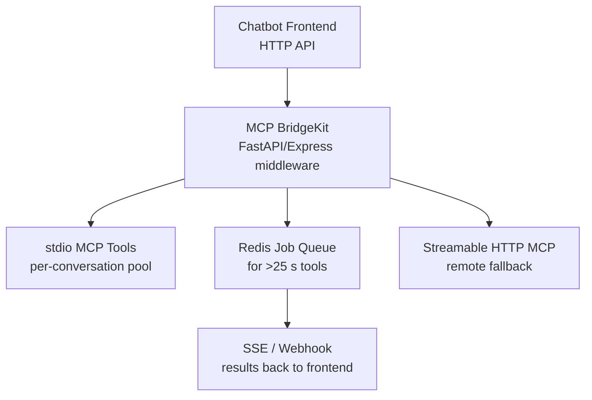

# MCP BridgeKit


**Universal stdio ↔ HTTP bridge for web chatbots**  
Survives 30 s Vercel/Cloudflare timeouts • 5-line embed • Python + TypeScript



## Install
```bash
pip install git+https://github.com/mkbhardwas12/mcp-bridgekit.git
# or npm i @mkbhardwas12/mcp-bridgekit (coming soon)
```
See `examples/` and `ts/` folders.

## Why it exists
Chatbots talk HTTP. MCP tools talk stdio. BridgeKit fixes that gap.

## 5-line example (FastAPI)
```python
from fastapi import FastAPI
from mcp_bridgekit import BridgeKit

app = FastAPI()
bridge = BridgeKit(redis_url="redis://localhost")

@app.post("/chat")
async def chat(req: dict):
    return await bridge.call(req["user_id"], req["messages"], config=req.get("mcp_config"))
```

## Features

- Smart stdio process pooling (per conversation or shared)
- Auto timeout-proofing (>25 s → instant {job_id} + Redis queue + SSE webhook)
- Dual transport: stdio ↔ Streamable HTTP ↔ REST fallback
- Full MCP spec (tools, resources, prompts, sampling)
- Beautiful self-hosted dashboard (HTMX)
- Vercel / Cloudflare / Railway / Docker ready

## Quickstart
```bash
pip install -e .
docker-compose up
```
See `examples/` for Vercel, Next.js, LangChain, etc.

---

Star us ⭐ — we're building the standard for agentic web backends.

Made with ❤️ for the MCP community.
