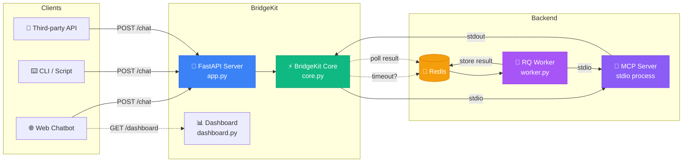
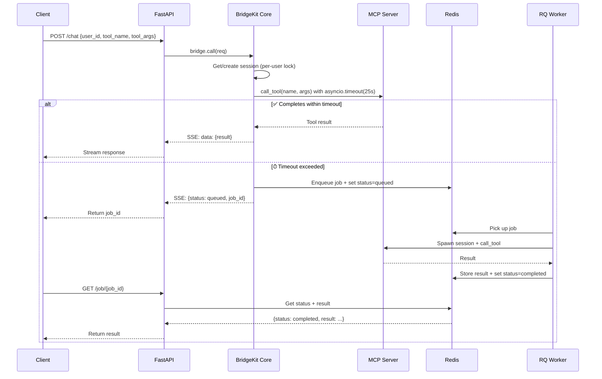
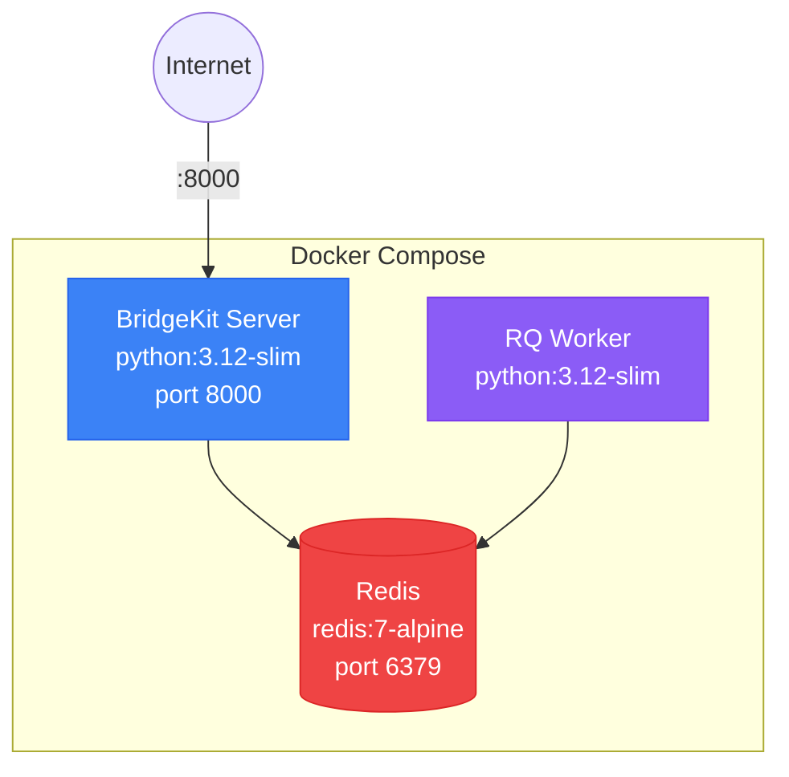
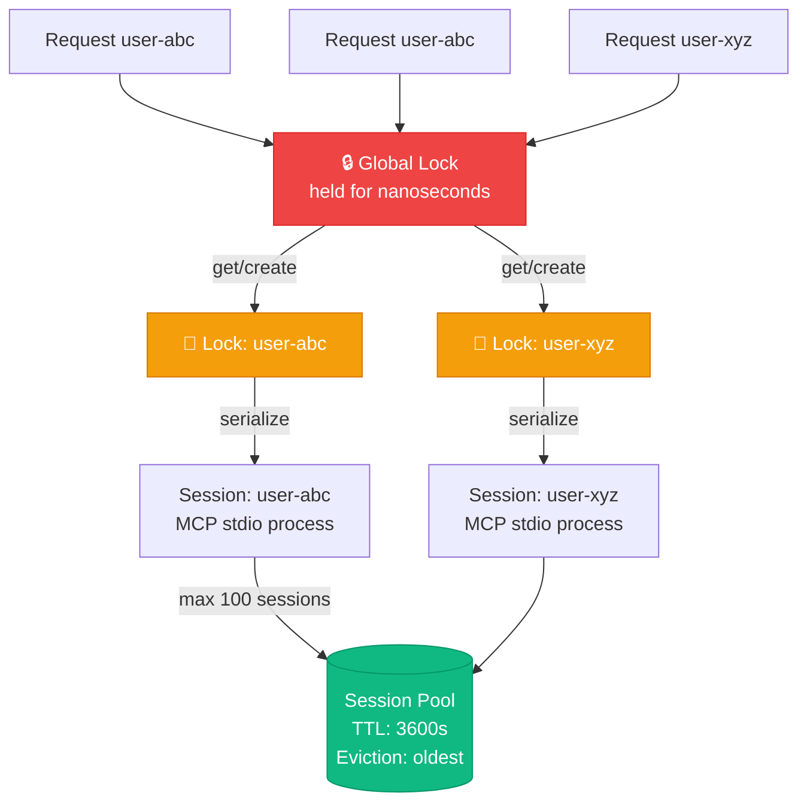
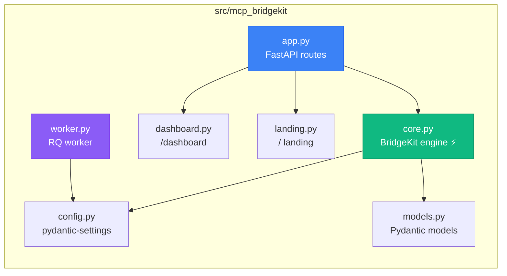

# MCP BridgeKit

**Embeddable MCP stdio → HTTP bridge for web chatbots.**

Turn any MCP stdio server into HTTP endpoints your web app can call. Per-user session pooling, real timeout handling with background job fallback, live dashboard.

 [](LICENSE) 

---

## Architecture



---

## Request Flow



---

## What It Does

- **Per-user sessions**: Each `user_id` gets its own MCP stdio process
- **Real timeout handling**: `asyncio.timeout()` wraps every tool call — if it exceeds the threshold, the call is automatically queued as a background job via Redis/RQ
- **Background job polling**: `GET /job/{job_id}` to check status/results
- **Tool discovery**: `GET /tools/{user_id}` lists available tools from the MCP server
- **Session management**: Auto-eviction when pool is full, TTL-based expiry, manual `DELETE /session/{user_id}`
- **Live dashboard**: HTMX + Tailwind — sessions, jobs, logs, tools (no build step)
- **Structured logging**: via structlog

## Quickstart

```bash
# Clone & install
git clone https://github.com/mkbhardwas12/mcp-bridgekit.git
cd mcp-bridgekit
pip install -e ".[dev]"

# Start Redis (required for job queue)
docker run -d -p 6379:6379 redis:7-alpine

# Run the server
uvicorn mcp_bridgekit.app:app --reload

# In another terminal — start the background worker
mcp-bridgekit-worker
```

Open http://localhost:8000 for the landing page, http://localhost:8000/dashboard for the live dashboard, http://localhost:8000/docs for API docs.

## Docker (Recommended)



```bash
docker-compose up
```

This starts Redis, the BridgeKit server (port 8000), and the RQ worker.

## API

### `POST /chat`
Call an MCP tool. Returns SSE stream. Auto-queues on timeout.

```json
{
  "user_id": "user-123",
  "messages": [{"role": "user", "content": "analyze sales data"}],
  "tool_name": "analyze_data",
  "tool_args": {"query": "Q4 revenue trends"},
  "mcp_config": {"command": "python", "args": ["examples/mcp_server.py"]}
}
```

### `GET /job/{job_id}`
Poll background job status. Returns `queued`, `running`, `completed` (with result), or `failed`.

### `GET /tools/{user_id}?command=python&args=examples/mcp_server.py`
List available tools from the MCP server.

### `DELETE /session/{user_id}`
Close a user's MCP session.

### `GET /health`
Health check with active session count.

## Concurrency Model



## Configuration

Set via environment variables or `.env` file (prefix: `MCP_BRIDGEKIT_`):

| Variable | Default | Description |
|----------|---------|-------------|
| `REDIS_URL` | `redis://localhost:6379` | Redis connection |
| `MAX_SESSIONS` | `100` | Max concurrent MCP sessions |
| `SESSION_TTL_SECONDS` | `3600` | Session expiry (1 hour) |
| `TIMEOUT_THRESHOLD_SECONDS` | `25.0` | Seconds before queuing as background job |
| `JOB_RESULT_TTL_SECONDS` | `600` | How long job results stay in Redis |
| `DEFAULT_MCP_COMMAND` | `python` | Default MCP server command |
| `DEFAULT_MCP_ARGS` | `["examples/mcp_server.py"]` | Default MCP server args |

## Embedding in Your App

```python
from fastapi import FastAPI
from mcp_bridgekit import BridgeKit, BridgeRequest

app = FastAPI()
bridge = BridgeKit()

@app.post("/chat")
async def chat(req: BridgeRequest):
    return await bridge.call(req)
```

## Project Structure



## TypeScript Version

A TypeScript implementation is available in `ts/`. Same architecture — session pooling, timeout handling, Redis queueing.

```bash
cd ts && npm install && npm run build && npm start
```

## 📐 Full Architecture Docs

See [ARCHITECTURE.md](ARCHITECTURE.md) for detailed diagrams and component docs. When running the server, visit `/architecture` for an interactive HTML version.

## License

MIT
