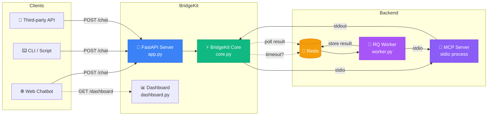
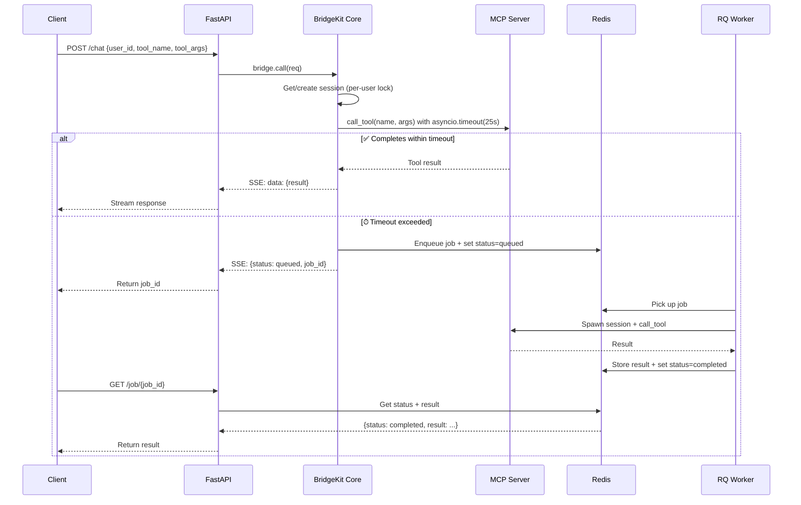
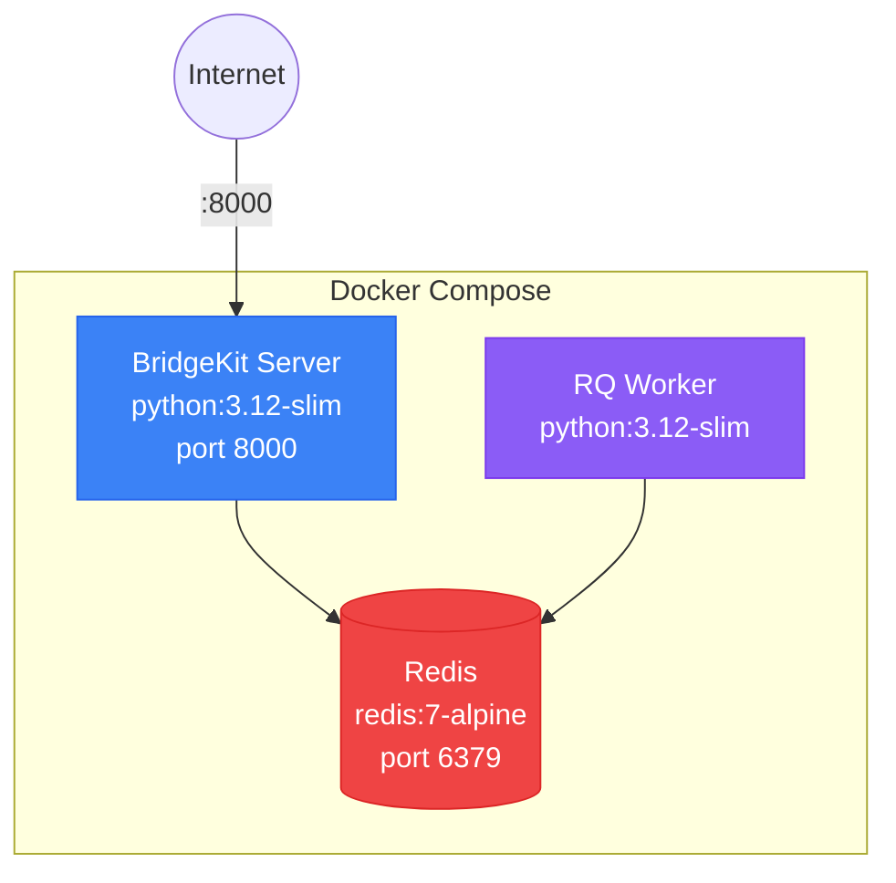
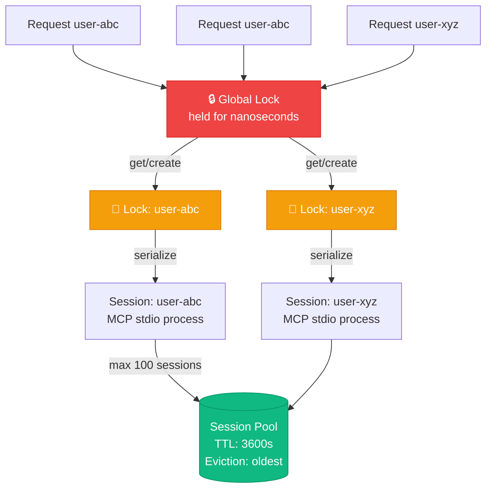
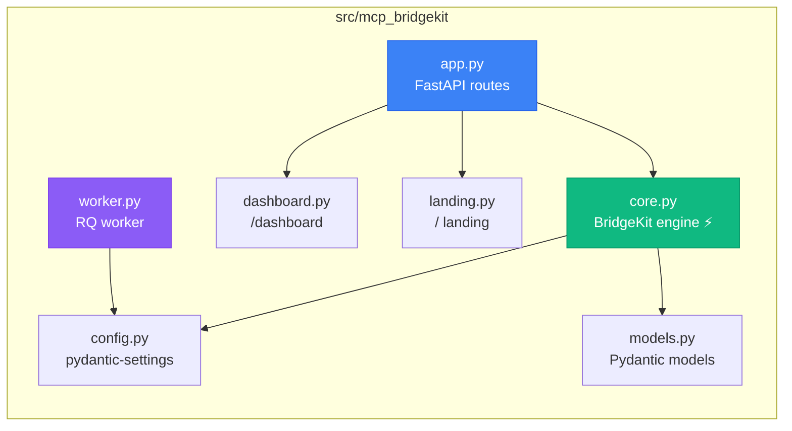

# MCP BridgeKit

**Embeddable MCP stdio → HTTP bridge for web chatbots.**

Turn any MCP stdio server into HTTP endpoints your web app can call. Per-user session pooling, real timeout handling with background job fallback, live dashboard.

 [](LICENSE) 

[](https://vercel.com/new/clone?repository-url=https%3A%2F%2Fgithub.com%2Fmkbhardwas12%2Fmcp-bridgekit&env=MCP_BRIDGEKIT_REDIS_URL&envDescription=Redis%20connection%20URL%20for%20session%20and%20job%20storage&envLink=https%3A%2F%2Fgithub.com%2Fmkbhardwas12%2Fmcp-bridgekit%23configuration&project-name=mcp-bridgekit&repository-name=mcp-bridgekit)

---

## Table of Contents

- [What Is MCP BridgeKit?](#what-is-mcp-bridgekit)
- [The Problem It Solves](#the-problem-it-solves)
- [Use Cases & Scenarios](#use-cases--scenarios)
- [Architecture](#architecture)
- [Request Flow](#request-flow)
- [Key Features](#key-features)
- [Quickstart](#quickstart)
- [Docker (Recommended)](#docker-recommended)
- [One-Click Deploy (Vercel)](#one-click-deploy-vercel)
- [API Reference](#api-reference)
- [Concurrency Model](#concurrency-model)
- [Configuration](#configuration)
- [Connecting to Any MCP Server](#connecting-to-any-mcp-server)
- [Embedding in Your App](#embedding-in-your-app)
- [Project Structure](#project-structure)
- [TypeScript Version](#typescript-version)
- [End-to-End Testing Guide](#end-to-end-testing-guide)
- [Horizontal Scaling](#horizontal-scaling)
- [Full Architecture Docs](#-full-architecture-docs)
- [License](#license)

---

## What Is MCP BridgeKit?

**MCP** (Model Context Protocol) is an open standard that lets AI applications connect to external tools and data sources. MCP servers communicate over **stdio** (stdin/stdout) — which means they run as local subprocesses and speak JSON-RPC over pipes.

**The problem**: Web applications (React, Next.js, Vue, mobile apps) can't spawn local subprocesses. They only speak HTTP. There's a protocol mismatch.

**MCP BridgeKit** is the bridge. It sits between your web app and MCP stdio servers, translating HTTP requests into stdio subprocess calls and streaming results back:

```
Your Web App  ──HTTP──▶  MCP BridgeKit  ──stdio──▶  MCP Server (tool)
                         (this project)
```

Think of it as **"nginx for MCP tools"** — a reverse proxy that makes stdio tools available over HTTP.

---

## The Problem It Solves

| Challenge | Without BridgeKit | With BridgeKit |
|-----------|-------------------|----------------|
| **Web app needs MCP tools** | Can't — browsers can't spawn subprocesses | `POST /chat` with tool name and args |
| **Multiple users sharing tools** | Each needs their own server setup | Per-user session pooling (up to 100 concurrent) |
| **Tool call takes 60 seconds** | HTTP gateway timeout (Vercel 30s, CloudFlare 30s) | Auto-queues as background job, client polls `GET /job/{id}` |
| **Which tools are available?** | Must read docs or hardcode | `GET /tools/{user_id}` — live discovery |
| **Monitoring & debugging** | Blind — no visibility | Live dashboard: sessions, jobs, logs, tools |
| **Session cleanup** | Zombie processes leak memory | Auto-eviction (TTL + pool limit) + manual `DELETE /session/{id}` |

---

## Use Cases & Scenarios

### 1. AI Chatbot with Tool Calling

> **Scenario**: You're building a customer support chatbot in React. The AI can call tools like `search_docs`, `create_ticket`, `check_order_status` — all implemented as MCP servers.

```
React App → POST /chat {tool: "search_docs", args: {query: "refund policy"}}
         ← SSE stream with search results
```

BridgeKit manages one MCP server process per conversation, so each user has isolated state.

### 2. Multi-Tenant SaaS Platform

> **Scenario**: Your SaaS lets customers connect their own MCP tools (data analysis, code generation, API integrations). Each customer uses different tools.

```
Customer A → POST /chat {user_id: "cust-A", mcp_config: {command: "python", args: ["their_tool.py"]}}
Customer B → POST /chat {user_id: "cust-B", mcp_config: {command: "node", args: ["their_tool.js"]}}
```

Each customer gets a dedicated session with their own MCP server. Pool manages up to 100 concurrent sessions with automatic eviction.

### 3. Long-Running Data Processing

> **Scenario**: An MCP tool runs complex SQL queries or ML inference that takes 45 seconds. Your frontend uses Vercel with a 30-second timeout.

```
Client → POST /chat {tool: "run_analysis", args: {dataset: "sales_2025"}}
       ← SSE: {status: "queued", job_id: "abc-123"}

# 45 seconds later...
Client → GET /job/abc-123
       ← {status: "completed", result: {revenue: 4200000, growth: "12%"}}
```

BridgeKit's `asyncio.timeout(25s)` catches the slow call, queues it via Redis/RQ, and a background worker completes it.

### 4. Internal Developer Tools

> **Scenario**: Your team has MCP tools for database queries, log analysis, and deployment — you want a single HTTP API to access all of them.

```bash
# Query production database
curl -X POST localhost:8000/chat \
  -d '{"user_id": "dev-1", "tool_name": "query_db", "tool_args": {"sql": "SELECT count(*) FROM users"}}'

# Check which tools are available
curl localhost:8000/tools/dev-1
```

Run `docker-compose up` and all your tools are accessible from any HTTP client.

### 5. Webhook / Integration Pipelines

> **Scenario**: A Slack bot, Zapier workflow, or n8n pipeline needs to call MCP tools based on triggers.

```
Slack Event → Zapier → POST /chat {tool: "summarize", args: {text: "..."}}
                     ← {result: "Here's the summary..."}
```

BridgeKit is a standard HTTP API — any integration platform can call it.

### 6. Mobile Applications

> **Scenario**: An iOS/Android app needs to call MCP tools but can't run subprocesses on the device.

```
Mobile App → POST https://your-server.com/chat
           ← SSE stream or job_id for polling
```

Deploy BridgeKit on your server, and mobile clients communicate over HTTPS.

### When NOT to Use BridgeKit

| Scenario | Better Alternative |
|----------|-------------------|
| CLI tool calling MCP servers locally | Use MCP SDK directly — no HTTP needed |
| MCP server already speaks HTTP (Streamable HTTP transport) | Connect directly — no bridge needed |
| Single-user desktop app | MCP SDK + stdio directly |

---

## Architecture



---

## Request Flow



---

## Key Features

- **Per-user sessions**: Each `user_id` gets its own MCP stdio process
- **Real timeout handling**: `asyncio.timeout()` wraps every tool call — if it exceeds the threshold, the call is automatically queued as a background job via Redis/RQ
- **Background job polling**: `GET /job/{job_id}` to check status/results
- **Tool discovery**: `GET /tools/{user_id}` lists available tools from the MCP server
- **Session management**: Auto-eviction when pool is full, TTL-based expiry, manual `DELETE /session/{user_id}`
- **Live dashboard**: HTMX + Tailwind — sessions, jobs, logs, tools (no build step)
- **Structured logging**: via structlog

## Quickstart

```bash
# Clone & install
git clone https://github.com/mkbhardwas12/mcp-bridgekit.git
cd mcp-bridgekit

# Copy environment config
cp .env.example .env   # edit if needed (all vars have sensible defaults)

# Install (pick one)
uv sync --dev          # recommended — fastest
pip install -e ".[dev]" # alternative

# Start Redis (required for job queue)
docker run -d -p 6379:6379 redis:7-alpine

# Terminal 1 — Run the server
uvicorn mcp_bridgekit.app:app --reload

# Terminal 2 — Start the background worker
mcp-bridgekit-worker
```

Open:
- http://localhost:8000 — Landing page
- http://localhost:8000/dashboard — Live dashboard
- http://localhost:8000/docs — Interactive API docs

## Docker (Recommended)



```bash
docker-compose up
```

This starts Redis, the BridgeKit server (port 8000), and 3 RQ worker replicas.

## One-Click Deploy (Vercel)

[](https://vercel.com/new/clone?repository-url=https%3A%2F%2Fgithub.com%2Fmkbhardwas12%2Fmcp-bridgekit&env=MCP_BRIDGEKIT_REDIS_URL&envDescription=Redis%20connection%20URL%20for%20session%20and%20job%20storage&envLink=https%3A%2F%2Fgithub.com%2Fmkbhardwas12%2Fmcp-bridgekit%23configuration&project-name=mcp-bridgekit&repository-name=mcp-bridgekit)

Click the button above to deploy your own instance. You'll need:

1. A **Redis instance** (e.g., [Upstash](https://upstash.com), [Railway](https://railway.app), or [Redis Cloud](https://redis.com/cloud/))
2. Set the `MCP_BRIDGEKIT_REDIS_URL` environment variable during setup

> **Note**: Vercel's 30s function timeout is exactly why BridgeKit exists — any MCP tool call exceeding 25s is automatically queued as a background job. Your users get a `job_id` instantly and poll for results.

## API Reference

### `POST /chat`
Call an MCP tool. Returns SSE stream. Auto-queues on timeout.

```json
{
  "user_id": "user-123",
  "messages": [{"role": "user", "content": "analyze sales data"}],
  "tool_name": "analyze_data",
  "tool_args": {"query": "Q4 revenue trends"},
  "mcp_config": {"command": "python", "args": ["examples/mcp_server.py"]}
}
```

### `GET /job/{job_id}`
Poll background job status. Returns `queued`, `running`, `completed` (with result), or `failed`.

### `GET /tools/{user_id}?command=python&args=examples/mcp_server.py`
List available tools from the MCP server.

### `DELETE /session/{user_id}`
Close a user's MCP session.

### `GET /health`
Health check with stats: active sessions, total requests, errors, queued jobs, known tools.

## Concurrency Model



## Configuration

Set via environment variables or `.env` file (prefix: `MCP_BRIDGEKIT_`):

| Variable | Default | Description |
|----------|---------|-------------|
| `REDIS_URL` | `redis://localhost:6379` | Redis connection |
| `MAX_SESSIONS` | `100` | Max concurrent MCP sessions |
| `SESSION_TTL_SECONDS` | `3600` | Session expiry (1 hour) |
| `TIMEOUT_THRESHOLD_SECONDS` | `25.0` | Seconds before queuing as background job |
| `JOB_RESULT_TTL_SECONDS` | `600` | How long job results stay in Redis |
| `DEFAULT_MCP_COMMAND` | `python` | Default MCP server command |
| `DEFAULT_MCP_ARGS` | `["examples/mcp_server.py"]` | Default MCP server args |

## Connecting to Any MCP Server

BridgeKit works with **any MCP server** — you just pass different `mcp_config` values.
The `mcp_config` tells BridgeKit which command to spawn:

### Supported MCP Servers

| MCP Server | `command` | `args` | Example Tools |
|---|---|---|---|
| **AWS MCP** | `npx` | `["-y", "@aws/aws-mcp"]` | `describe_instances`, `list_s3_buckets` |
| **AWS CDK** | `npx` | `["-y", "@aws/aws-cdk-mcp-server"]` | `GenerateCDK`, `ExplainCDK` |
| **AWS Docs** | `npx` | `["-y", "@aws/aws-documentation-mcp-server"]` | `search_documentation` |
| **GitHub** | `npx` | `["-y", "@modelcontextprotocol/server-github"]` | `search_repositories`, `create_issue` |
| **Filesystem** | `npx` | `["-y", "@modelcontextprotocol/server-filesystem", "/data"]` | `read_file`, `write_file` |
| **PostgreSQL** | `npx` | `["-y", "@modelcontextprotocol/server-postgres"]` | `query` |
| **Custom Python** | `python` | `["/path/to/server.py"]` | Whatever you define |

### Quick Example: AWS MCP from Your API

```python
import httpx

BRIDGEKIT_URL = "http://your-bridgekit-host:8000"

# Step 1: Discover available tools
resp = await httpx.AsyncClient().get(
    f"{BRIDGEKIT_URL}/tools/discovery",
    params={"command": "npx", "args": "-y,@aws/aws-mcp"},
)
print(resp.json())  # Shows all tools with schemas

# Step 2: Call a tool
async with httpx.AsyncClient(timeout=60.0) as client:
    resp = await client.post(f"{BRIDGEKIT_URL}/chat", json={
        "user_id": "user-123",
        "messages": [{"role": "user", "content": "list instances"}],
        "mcp_config": {
            "command": "npx",
            "args": ["-y", "@aws/aws-mcp"],
        },
        "tool_name": "describe_instances",
        "tool_args": {"region": "us-east-1"},
    })
```

Prerequisites: Install the MCP server package on the BridgeKit host (`npm install -g @aws/aws-mcp`) and configure AWS credentials.

> **Full guide**: See [docs/INTEGRATION_GUIDE.md](docs/INTEGRATION_GUIDE.md) for deployment on AWS, credential setup, polling for long-running jobs, and complete working examples.

> **Code examples**: See [examples/aws_integration.py](examples/aws_integration.py) for 8 ready-to-use endpoint patterns.

## Embedding in Your App

```python
from fastapi import FastAPI
from mcp_bridgekit import BridgeKit, BridgeRequest

app = FastAPI()
bridge = BridgeKit()

@app.post("/chat")
async def chat(req: BridgeRequest):
    return await bridge.call(req)
```

## Project Structure



## TypeScript Version

A TypeScript implementation is available in `ts/`. Same architecture — session pooling, timeout handling, Redis queueing.

```bash
cd ts && npm install && npm run build && npm start
```

## End-to-End Testing Guide

Verify everything works with these steps:

### 1. Start Services

```bash
# Option A — Docker (easiest)
docker-compose up --build

# Option B — Manual (3 terminals)
# T1: docker run -d -p 6379:6379 redis:7-alpine
# T2: mcp-bridgekit-worker
# T3: uvicorn mcp_bridgekit.app:app --reload --port 8000
```

### 2. Check Dashboard

Open http://localhost:8000/dashboard — should show 0 sessions, 0 jobs.

### 3. Call a Tool (instant response)

```bash
curl -N -X POST http://localhost:8000/chat \
  -H "Content-Type: application/json" \
  -d '{
    "user_id": "test-001",
    "messages": [{"role": "user", "content": "hello"}],
    "tool_name": "analyze_data",
    "tool_args": {"query": "test query"}
  }'
```

→ SSE stream with result appears immediately. Dashboard shows 1 active session.

### 4. Test Timeout Survival (background job)

Edit `examples/mcp_server.py` — change `asyncio.sleep(2)` to `asyncio.sleep(35)`, then re-run the curl above.

→ Immediate response: `{"status": "queued", "job_id": "..."}`  
→ Dashboard updates live (Queued Jobs increases)  
→ Worker terminal shows processing

### 5. Poll Job Result

```bash
curl http://localhost:8000/job/{job_id_from_step_4}
```

→ Returns `{"status": "completed", "result": {...}}` once the worker finishes.

### 6. List Available Tools

```bash
curl "http://localhost:8000/tools/test-001"
```

### 7. Cleanup Session

```bash
curl -X DELETE http://localhost:8000/session/test-001
```

### 8. Health Check

```bash
curl http://localhost:8000/health
```

→ Returns active sessions, request counts, error counts, queue depth.

**Expected result**: Tools respond instantly → slow tools get queued → dashboard shows live updates → sessions scale cleanly.

---

## Horizontal Scaling

BridgeKit is designed to scale horizontally:

| Component | How to Scale | Notes |
|-----------|-------------|-------|
| **Web server** | `gunicorn --workers N` | Dockerfile defaults to 4 workers. Each worker has its own event loop. |
| **RQ workers** | Run multiple `mcp-bridgekit-worker` processes | docker-compose defaults to 3 replicas. All point to the same Redis. |
| **Redis** | Use managed Redis (Upstash, ElastiCache, Redis Cloud) | Single Redis handles thousands of connections. |
| **Multi-machine** | Run workers on different machines pointing to same Redis | `MCP_BRIDGEKIT_REDIS_URL=redis://your-redis-host:6379` |

```bash
# Scale workers to 5 replicas
docker-compose up --scale worker=5

# Or run standalone workers on any machine
MCP_BRIDGEKIT_REDIS_URL=redis://shared-redis:6379 mcp-bridgekit-worker
```

---

## 📐 Full Architecture Docs

See [ARCHITECTURE.md](ARCHITECTURE.md) for detailed diagrams and component docs. When running the server, visit `/architecture` for an interactive HTML version.

## License

MIT
